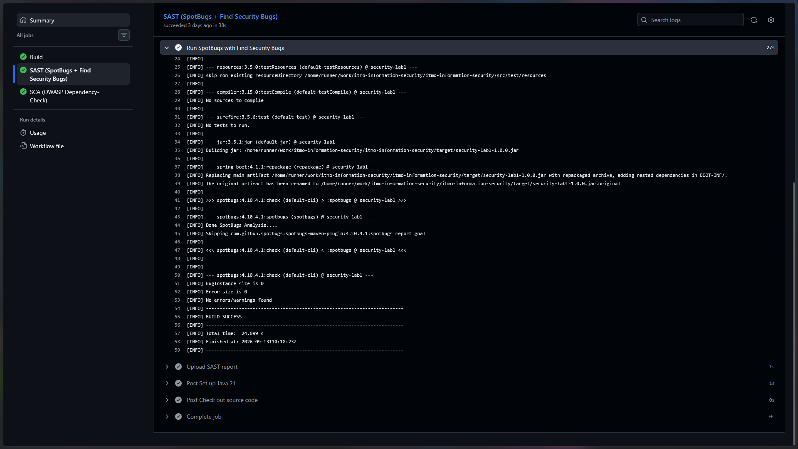
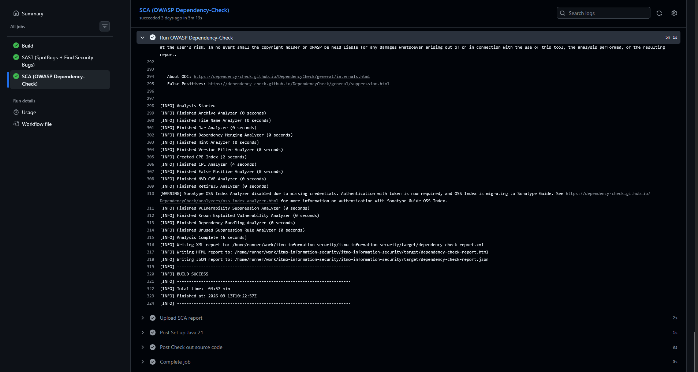
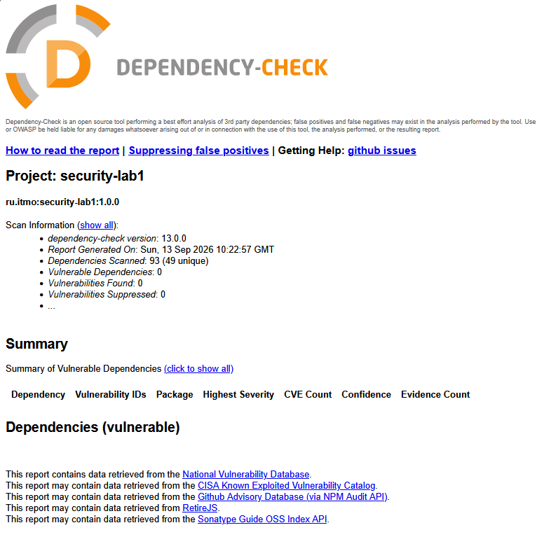

# Лабораторная работа № 1: защищённое REST API

Учебное REST API заметок для демонстрации базовых мер защиты backend-приложения. Проект реализован на Java 21 и Spring Boot 4.1.1, собирается Maven и использует файловую базу данных H2.

## Запуск

Для запуска нужны JDK 21 и доступ к Maven Central. В PowerShell выполните:

```powershell
$env:JAVA_HOME = 'C:\Program Files\Java\jdk-21'
$env:LAB1_JWT_SECRET = [guid]::NewGuid().ToString('N') + [guid]::NewGuid().ToString('N')
$env:LAB1_DEMO_ALICE_PASSWORD = 'AliceDemo2026!'
$env:LAB1_DEMO_BOB_PASSWORD = 'BobDemo2026!'
$env:SPRING_PROFILES_ACTIVE = 'demo'
.\mvnw.cmd spring-boot:run
```

Приложение будет доступно по адресу `http://127.0.0.1:8080`. Профиль `demo` создаёт пользователей `alice` и `bob`; их пароли задаются переменными окружения, а в H2 сохраняются только BCrypt-хэши.

## API

| Метод | Путь | Доступ | Назначение |
|---|---|---|---|
| `POST` | `/auth/login` | открытый | Принимает логин и пароль, возвращает JWT |
| `GET` | `/api/data` | Bearer JWT | Возвращает заметки текущего пользователя |
| `POST` | `/api/data` | Bearer JWT | Создаёт заметку текущего пользователя |

Для входа отправьте запрос:

```http
POST /auth/login
Content-Type: application/json

{"username":"alice","password":"AliceDemo2026!"}
```

Из ответа возьмите `accessToken` и передавайте его в защищённые запросы:

```http
Authorization: Bearer <accessToken>
```

Для создания заметки отправьте:

```http
POST /api/data
Authorization: Bearer <accessToken>
Content-Type: application/json

{"title":"Заголовок","content":"Текст заметки"}
```

`GET /api/data` возвращает массив заметок владельца токена. Без действительного JWT защищённые методы возвращают `401 Unauthorized`.

Готовые запросы находятся в [`postman/lab1.postman_collection.json`](postman/lab1.postman_collection.json). Вместе с коллекцией можно импортировать окружение [`postman/local.postman_environment.json`](postman/local.postman_environment.json) и заполнить переменные `alicePassword` и `bobPassword`.

## Реализованные меры защиты

### Защита от SQL-инъекций

Доступ к данным реализован через Spring Data JPA и Hibernate. Методы `UserRepository.findByUsername` и `NoteRepository.findAllByOwnerIdOrderByCreatedAtDesc` передают пользовательские значения как связанные параметры. Строки из запроса не объединяются с SQL или JPQL, поэтому введённые данные не могут изменить структуру запроса.

### Защита от XSS

Пользовательские поля `title` и `content` экранируются функцией `HtmlUtils.htmlEscape` при формировании response DTO. HTML-символы возвращаются как текст и не интерпретируются браузером как разметка или сценарий. Исходное значение хранится в базе без повторного экранирования.

### Аутентификация и контроль доступа

Пароли хранятся только как BCrypt-хэши. После успешного входа сервер выдаёт JWT сроком действия 15 минут. Spring Security проверяет HS256-подпись, срок действия, издателя и аудиторию. Секрет подписи поступает из переменной окружения `LAB1_JWT_SECRET` и не хранится в репозитории.

Идентификатор владельца заметки берётся из проверенного JWT. Клиент не может указать владельца самостоятельно, а запрос списка фильтрует записи по текущему пользователю.

## SAST и SCA в GitHub Actions

### SAST: SpotBugs и Find Security Bugs

Проверка завершилась успешно, SpotBugs не обнаружил ошибок или предупреждений.



### SCA: OWASP Dependency-Check

Проверка завершилась успешно, уязвимые компоненты не были обнаружены.




